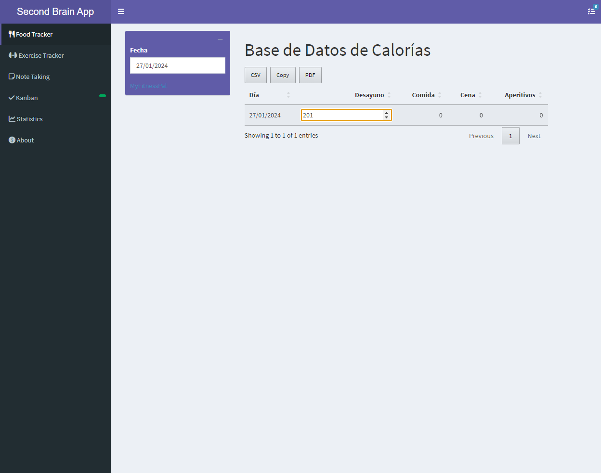
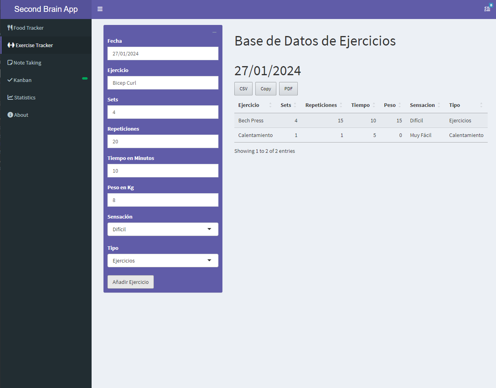
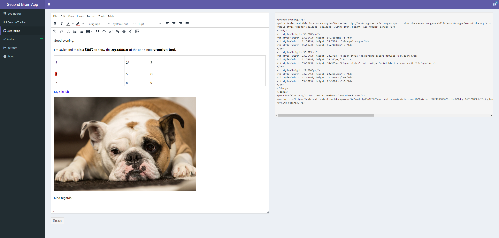
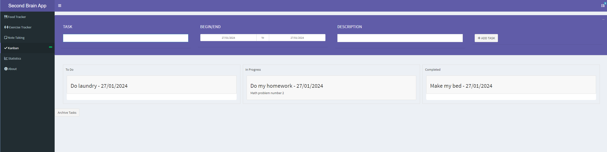

# Second Brain App

This is an application to keep track of your daily calorie intake and exercise. It is very rudimentary, but to get some consistency it is good to start with.

I created this application to satisfy my personal need to have a specific app for it and to become more fluent in R programming. Also, you can make this ShinyApp as a Desktop App following the steps from [this GitHub](https://github.com/wleepang/DesktopDeployR), which is something I used personaly.

This project is based on ideas from books such as [Atomic Habits](https://www.amazon.es/Atomic-Habits-Proven-Build-Break/dp/1847941834) and [Building a Second Brain](https://www.amazon.es/Building-Second-Brain-Organise-Potential/dp/1800812213/ref=sr_1_2?keywords=building+a+second+brain).

## What can the app do?

The application has several sections, the food tracker, the exercise tracker, the note taking section, the kanban board and the statistics section which will become more useful as you use the application.

### Food Tracker

This section has a direct link to MyFitnessPal where it is assumed that you track your diet and calorie intake, the data returned by this website is what you have to add to the app.

I did this because the statistics on your calorie intake is paid for on this website. So I started to write down the data myself and make statistics on it.

### Exercise Tracker 

This section has a series of inputs: 

- The date of the day you have exercised, it defaults to today but you can change it to any date you want. 
- The name of the exercise.
- The sets and reps you have done
- The time in minutes you have been doing the exercise counting the breaks between sets.
- The weight in kilograms of the dumbbells.
- Your feelings about whether the exercise was particularly easy or difficult.
- The type of exercise, whether it was warm-up, exercise or post-workout.

### Note Taking 

The notes that you create are saved in HTML format in **www/HTML Notes/** inside the app directory.

This part implements a library for taking notes that is based on services used by WordPress and some universities like mine (University of Seville). You can use it to generate notes with all the elements that could be used for example in a Word or LibreOffice file and saved in HTML format. 

My plan was to implement a converter from HTML to some other format but there are thousands online.

### Kanban 

This section is implemented with a library that allows you to create drag and drop elements. It is in a very early stage of development but is functional.

## What is Building A Second Brain?

Building a second brain or in short "BASB", this is a method or note management system that systematically writes down and saves and manages our knowledge, inspiration, and insights through digital note taking software.

Compared to the human brain, which has a limited memory, this method can be used to expand our memory and intellect using modern technology and web-based tools, hence the name second brain. Software in itself is critical, but what matters more is the thinking behind it.

Well, now you know it, this is basically a knowledge management system of yourself.

## How to build a second brain

BASB, short for build a second brain, is a way to preserve and systematically remind us of the ideas, inspirations, insights, and connections we have gained from our experiences. According to Tiago Forte's website, there are three main steps to building a second brain.

- Part 1: Remember
- Part 2: Connect
- Part 3: Create

These are all the steps you need to build a second brain, which I will explain below.

### Part 1: Remember

The process of keeping several pieces of valuable information in one place is remembering. You can save your notes in different digital note-taking software like Evernote, notion, obsidian, Microsoft OneNote, Bear, etc. Saving can be in the form of storing hyperlinks, images, web pages, screenshots, PDFs and other attachments, all of which are permanently saved and synchronized across all your devices.

Filtering the information is critical, not keeping everything. You'll have to select and choose wisely. You should pick high-value, impactful information that is valuable, and those that are recurring themes and issues, and save anything that "resonates" with you on an intuitive level. This is usually because it relates to something you care about, are curious about, or find intrinsically interesting.

### Part 2: Connections

You should pay attention to the intrinsic connections in the knowledge you have gathered, and review your notes often to distill the main points. It is important to summarise your notes at various stages of time.Using your understanding, summarize the original notes into excerpts, then summarize the excerpts again.

This can be understood as a step-by-step condensation process, but you will need to incorporate your thinking about your knowledge in this process. This makes it easy for you to look at this content within seconds and determine if it is useful to your current task, i.e., if it creates a connection.

### Part 3: Create

Creating is the process of exporting the content from your notes to create tangible results in the real world. It doesn't matter if it's a written piece, a website, a photo, a video or a live performance - all convey the knowledge we've gained from our experiences. Bringing something real, beautiful, meaningful into existence makes you feel rewarded.

At the same time, by consistently sharing your work with others - whether it's your family, friends, colleagues, or outside on social media - all kinds of benefits will begin to materialize. You will connect with new collaborators who you never thought would find your work compelling. From there, your note taking system will impact and improve your life.